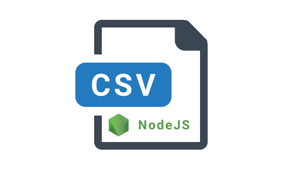

# CSV Node

<p align="center">
  
</p>

<h3 align="center"> 
  An awesome library for manager csv files  with <code>javascript/typescript</code>
</h3>

<div align="center">

[](https://github.com/david32145/csv-node/actions)

</div>

## Overview

The library is for read csv and manager csv tables like humam, automating the process of read
and serializer the csv rows to obeject.

## Sumary

- [Features](#features)
- [Install](#install)
- [Usage](#usage)
  - [Basic Usage](#basic-usage)
  - [Options](#options)
  - [Options Usage](#options-usage)
    - [Alias](#alias)
    - [Skip Lines](#skip-lines)
    - [Limit](#limit)
 - [The filePath](#the-filePath)
 - [Typescript Support](#typescript-support)

## Features

- Read an csv file and serializer data to `javascript/typescript` objects;
- Alias in colunms of csv table;
- Skip row of csv;
- Limit numbers of rows.

## Next Features

- Map row;
- Agregates function (max, min, avg) in an colunm;
- Filter rows.

## Install

```bash
npm install csv-node
```

or

```bash
yarn add csv-node
```

## Usage

First import function _createReadCSVFile_ of _csv-node_.

### Basic usage

```js
// names.csv
name,age
Joh,19
Mary,20
Nicoll,21
```

```js
import { createReadCSVFile } from "csv-node"
import path from "path"
// or const createReadCSVFile = require("csv-node")

const filePath = path.resolver(__dirname, "names.csv")

const csvReader = createReadCSVFile(filePath)

const names = csvReader.read()
console.log(names)
/* [
*   {
*     "name": "Joh",
*     "age": "19"
*   },
*   {
*     "name": "Mary",
*     "age": "20"
*   },
*   {
*     "name": "Nicoll",
*     "age": "21"
*   }
* ]´
**/
```

### Options

The second param of `createReadCSVFile` is an object of options, the options availables are.

|name|description|type|requires|
|:-----|:-----|:---:|:-----|
|alias|An object that will rename collumns|`object`|false|
|skipLines|The numbers of lines for skipping|`number`|false|
|limit|The numbers max of rows|`number`|false|

### Options usage

#### Alias

```js
const csvReader = createReadCSVFile(filePath, {
  alias: {
    name: "Name"
  }
})

const names = csvReader.read()
console.log(names)
/* [
*   {
*     "Name": "Joh",
*     "age": "19"
*   },
*   {
*     "Name": "Mary",
*     "age": "20"
*   },
*   {
*     "Name": "Nicoll",
*     "age": "21"
*   }
* ]´
**/
```

#### Skip Lines

```js
const csvReader = createReadCSVFile(filePath, {
  skipLines: 1
})

const names = csvReader.read()
console.log(names)
/* [
*   {
*     "Name": "Mary",
*     "age": "20"
*   },
*   {
*     "Name": "Nicoll",
*     "age": "21"
*   }
* ]´
**/
```

#### Limit

```js
const csvReader = createReadCSVFile(filePath, {
  limit: 2
})

const names = csvReader.read()
console.log(names)
/* [
*   {
*     "Name": "Joh",
*     "age": "19"
*   },
*   {
*     "Name": "Mary",
*     "age": "20"
*   }
* ]´
**/
```

the options can be combined.

## The filePath

`filePath` must be absolute or `csv-node` search the file startirg of root folder of project node.

## Typescript Support

The library provider typescript support.

```ts
interface Person {
  name: string
  age: number
}

const csvReader = createReadCSVFile<Person>(filePath)

const names = csvReader.read() // Return Person[]
console.log(names)
/* [
*   {
*     "name": "Joh",
*     "age": "19"
*   },
*   {
*     "name": "Mary",
*     "age": "20"
*   },
*   {
*     "name": "Nicoll",
*     "age": "21"
*   }
* ]´
**/
```
